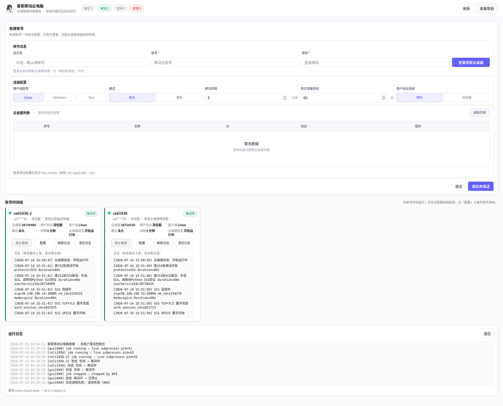
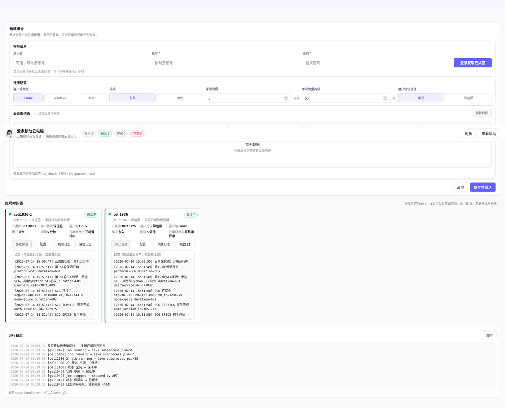
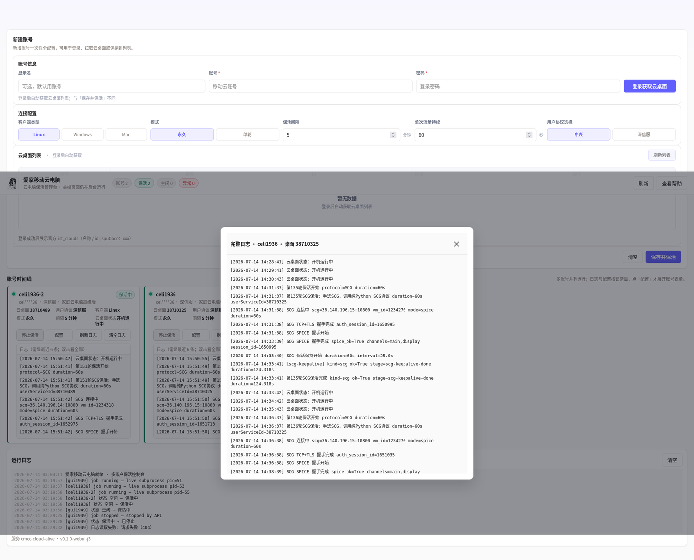

# 爱家移动云电脑

[](LICENSE)
[](https://www.python.org/)
[](docker/docker-compose.yml)
[](#这个工具能做什么)
[](https://github.com/1936-zero/cmcc-cloud-alive)

> 多账号云电脑保活：命令行交互版 + Docker WebUI 管理台。  
> 品牌名统一：**爱家移动云电脑**。

这是一个给普通用户使用的保活工具。安装后按提示登录账号、选择云电脑、**自己选择保活协议**，就可以让程序定时发送保活流量，减少云电脑因为空闲而自动关机的情况。

> 你不需要会写代码，也不需要手动编辑 json 文件。大多数情况下，只要复制命令、按中文提示选择即可。

## 这个工具能做什么？

- 登录爱家移动云电脑账号（支持**主帐号**与**子帐号**两种登录方式）。
- 自动读取你的云电脑列表。
- 手动选择要保活的云电脑。
- **手动选择保活协议**：`ZTE`（中兴）或 `SCG`（深信服）——协议权归你，程序不会擅自改。
- 云电脑未开机时，首次检测会自动开机一次。
- 云电脑已运行后，按你设置的间隔循环保活。
- token 失效时，会用已保存的账号密码自动重新登录并继续保活（沿用你上次的主/子登录方式）。
- 支持一个账号多台云电脑、多账号多开（CLI 多终端 / WebUI 多卡片）。

## 使用前需要准备什么？

按你选的路径准备：

| | 方式 A：Python 交互版（CLI） | 方式 B：Docker 网页版（WebUI） |
|---|---|---|
| 适合谁 | 习惯终端、单机逐台操作 | 想用浏览器管理、多账户并行 |
| 本机需要 | Git + Python 3.10+ + pip/venv | Docker 与 Compose 插件（**无需**本机 Python） |
| 怎么用 | 激活 `.venv` 后 `python3 -m cmcc_cloud_alive` | 一键 `docker compose` 后打开网页 |
| 协议 | 你自己点选 ZTE / SCG | 每张卡片你自己点选 |
| 默认模式 | 交互确认后真实保活 | **默认即为真实 live 保活**，无需额外开关 |

> **无需代理配置**：本程序直接连接移动云电脑服务，不需要配置 `http_proxy` / `https_proxy`。  
> Docker 容器内也**禁止走代理**，与交互版同一套源码链路。

---

## 一键安装并启动

### 方式 A：本机 Python 交互版（推荐先跑通）

#### Ubuntu / Debian / 云服务器

复制整段到终端执行：

```bash
sudo apt update && sudo apt install -y git python3 python3-venv python3-pip \
&& git clone https://github.com/1936-zero/cmcc-cloud-alive.git \
&& cd cmcc-cloud-alive \
&& python3 -m venv .venv \
&& . .venv/bin/activate \
&& python3 -m pip install -U pip \
&& python3 -m pip install -e . \
&& python3 -m cmcc_cloud_alive
```

#### macOS

先安装 Homebrew，然后执行：

```bash
brew install git python

git clone https://github.com/1936-zero/cmcc-cloud-alive.git
cd cmcc-cloud-alive
python3 -m venv .venv
. .venv/bin/activate
python3 -m pip install -U pip
python3 -m pip install -e .
python3 -m cmcc_cloud_alive
```

#### Windows

使用 PowerShell 执行：

```powershell
git clone https://github.com/1936-zero/cmcc-cloud-alive.git
cd cmcc-cloud-alive
py -3 -m venv .venv
.\.venv\Scripts\Activate.ps1
python -m pip install -U pip
python -m pip install -e .
python -m cmcc_cloud_alive
```

如果 PowerShell 提示禁止运行脚本，先执行：

```powershell
Set-ExecutionPolicy -Scope CurrentUser RemoteSigned
```

然后重新执行：

```powershell
.\.venv\Scripts\Activate.ps1
python -m cmcc_cloud_alive
```

按中文提示操作：登录 → 选云桌面 → **自己选择协议**（深信服 SCG / 中兴 ZTE）→ 开始保活。  
协议由你点选，程序不会擅自改你已保存账号的协议。

已在项目目录且依赖装好时，也可直接：

```bash
python3 -m cmcc_cloud_alive --help
```

### 方式 B：Docker 网页版 WebUI（小白一键）

需要本机已装 **Docker** 与 **Docker Compose 插件**（`docker compose version` 能跑通即可）。**不需要**本机装 Python。

在仓库根目录复制执行：

```bash
git clone https://github.com/1936-zero/cmcc-cloud-alive.git
cd cmcc-cloud-alive
docker compose -f docker/docker-compose.yml up -d --build
```

浏览器打开：

```text
http://127.0.0.1:28080
```

（默认只绑本机 `127.0.0.1:28080`。要改端口可先 `export CMCC_HOST_PORT=端口号` 再启动。）

界面预览：

| 新建账号表单 + 多卡片 | 双卡片保活中 | 完整日志弹层 |
|---|---|---|
|  |  |  |

常用：

```bash
# 看日志
docker compose -f docker/docker-compose.yml logs -f cmcc-webui

# 停止（数据保留在 Docker volume）
docker compose -f docker/docker-compose.yml down

# 更新代码后重建
git pull
docker compose -f docker/docker-compose.yml up -d --build
```

健康检查：

```bash
curl -s http://127.0.0.1:28080/api/health
```

正常时 JSON 里 `ok` 为 `true`、`status` 为 `up`，且 `orchestrator` 为 `Orchestrator`。

WebUI 是壳：卡片 / 表单 / 日志；真正保活走与交互版同一套 `cmcc_cloud_alive` 源码（SCG / ZTE）。  
**默认即为真实 live 保活**，无需额外环境变量。账号与云桌面在网页里添加；每张卡片可单独选协议、模式、间隔。

**协议选择权在用户**：点「中兴」或「深信服」即可；空值时仅历史回落 ZTE，不会因为缺省值把你的账号改成 SCG。

全局「运行日志」与卡片日志时戳均为 **Asia/Shanghai** 完整格式 `YYYY-MM-DD HH:mm:ss`（与交互版一致）。

### 主帐号 / 子帐号（WebUI 与 CLI 通用）

爱家移动云电脑账号分**主帐号**与**子帐号**。两者用不同登录接口，但**保活链路同一套**（同一份 `cmcc_cloud_alive` 源码）。

| | 主帐号 | 子帐号 |
|---|---|---|
| 适用 | 家庭主号 / 手机号主登录 | 主号下开通的子帐号名 |
| WebUI 操作 | 填好显示名、帐号、密码后点 **「主帐号获取云桌面」** | 同样填写后点 **「子帐号获取云桌面」** |
| 按钮作用 | 仅登录并拉取官方云桌面列表，**不会**自动开始保活 | 同左 |
| 会话档案 | 写入共享 `acct_*.json`（含 `isSubAccount` / `loginMode`） | 同一档案，标记为子帐号登录 |
| 后续保活 | 点卡片「开始」；token 过期按**主帐号**方式重登 | 点卡片「开始」；token 过期按**子帐号**方式重登 |

补充说明：

1. **主/子不要混用错按钮**：用子帐号名却点主帐号登录会失败；反之亦然。选错后改点正确按钮重新获取列表即可。
2. **CLI 交互版**同样支持主/子登录；WebUI 与 CLI 对同一账号应避免同时登录。
3. 若云桌面被占用（桌面会话锁），可在卡片上使用 **「桌面登出」** 释放，再重新开始保活（CLI 对应 `logout` / `desktop-logout` 命令）。

---

## 用 Docker 启动网页版 WebUI

> 上一节「方式 B」已覆盖小白一键。本节补充数据卷、多账户与排障细节。

### 前置条件

- 已安装 **Docker**
- 已安装 **Docker Compose 插件**（`docker compose version` 能跑通）
- 本机**不需要**安装 Python / venv（WebUI 跑在容器里）

### 多账户与并行任务

在 WebUI 里可以为不同账号 / 云电脑创建多个 **profile**，分别配置后并行保活。不必像 CLI 那样再开多个终端窗口。

**同账号多卡片**：须共享同一份 state（`--state acct_*`），分文件会互踢 token。也**不要**与 host 上交互版对同一账号同时登录。

### 数据卷与密钥

- 档案与运行状态落在 Docker volume **`cmcc_data`**（容器内挂载 `/data`）。统一数据根为 **`/data/.cmcc-cloud-alive`**（profiles/jobs/locks），与 CLI `~/.cmcc-cloud-alive` 一致；不会写进 Git 仓库。
- 可选的访问令牌等请放在主机本地 `.env`（compose 已支持可选 `env_file`），**不要把密钥提交到 Git，也不要打进镜像**。
- WebUI 鉴权用法见下文 **「WebUI 访问密钥」**：首次打开可在页面设置密钥（写入数据目录），或 `.env` 的 `CMCC_WEBUI_TOKEN`；之后登录门 / 顶栏「设置令牌」改密。

### WebUI 访问密钥

可选。保护控制台 API（删账号/开保活等），**不是**云电脑账号，**不影响保活协议**。打开原网址即可，密钥在门页填写，**不要拼进 URL**。

| 场景 | 做法 |
|---|---|
| 首次 | 打开 `http://IP:28080` → 向导输入或「随机生成」→ 保存（写入数据目录，优先于 `.env`） |
| 之后 / 换设备 | 同一网址 → 登录门输入密钥 |
| 改密 / 清本机 | 顶栏「设置令牌」（清本机不删服务器密钥） |
| 预置 | `.env` 写 `CMCC_WEBUI_TOKEN=…` 后重启；已有 token 文件优先 |

```bash
curl -sS http://127.0.0.1:28080/api/system/info
# tokenRequired=true 表示已开启
```

错误示例：~~`http://ip:28080/密钥`~~、~~`?token=…`~~。勿把 `.env` / `webui_access_token` / 真实密钥提交 Git 或贴进截图。

### 与 CLI 的关系

- 同一仓库、同一业务能力；CLI 与 WebUI **互不强制**。
- WebUI 只是壳，底层就是交互版那套源码；容器内禁止走代理。
- CLI 路径：安装依赖后执行 `python3 -m cmcc_cloud_alive`（见上文方式 A）。
- 也可以在同一镜像里临时跑 CLI 帮助，例如：

```bash
docker compose -f docker/docker-compose.yml run --rm cmcc-webui cmcc-cloud-alive --help
```

---

## 第一次怎么用？（CLI）

启动后看到类似界面：

```text
爱家移动云电脑保活工具
请输入命令：login 登录并开始保活；help 查看帮助；exit 退出。
cmcc>
```

输入：

```text
login
```

然后按中文提示操作：

1. 选择保活档案。
   - 第一次用，选择“新增一个账号/云桌面档案”。
   - 以后继续之前的云电脑，选择已有档案。
2. 输入爱家移动云电脑账号。
3. 输入密码。
4. 程序自动读取云电脑列表。
5. 输入序号选择要保活的云电脑。
6. **手动选择协议**：`ZTE` 或 `SCG`。
   - 你选 ZTE，程序就走 ZTE。
   - 你选 SCG，程序就走 SCG。
   - 程序不会偷偷替你自动切换协议。
7. 程序展示官方自动关机提示，例如：

```text
[官方自动关机时长]：<官方接口返回的提示文案>
```

8. 设置保活间隔、每轮保活持续秒数、运行轮数。
9. 程序开始保活。

如果当前云电脑没有开机，程序首次检测时会自动开机一次；后续循环只做保活和状态检测，不会反复开机。

### 官方维护 / 批量关机时进程会不会挂？

- **交互连续保活**：每轮异常会被外层循环吞掉并进入下一轮，进程不因单轮 CEM/维护错误退出。
- **CLI `--forever`**：SCG 路径启用 `reconnect_fn` 软恢复——遇到 CEM 502 / 连接被维护打断时，会重新拉 connect-info 并续连，而不是直接崩掉。
- 单轮冒烟（`--duration` 有限、非 forever）仅用于验证能否连通，不保证维护窗口内自动续命。

### 产品锁定（可选，默认关闭）

公开使用**不需要**任何产品 ID。只有开发者验收 / LIVE harness 需要把会话钉在指定云电脑时：

```bash
export CMCC_ENFORCE_PIN=1
export CMCC_PRODUCT_USID=<你的 userServiceId>
export CMCC_PRODUCT_VMID=<你的 vmId>
# 可选
export CMCC_PRODUCT_SPU=<spuCode>
```

未设置 `CMCC_ENFORCE_PIN` 时，交互菜单选中的任意云电脑都可以保活。

## 以后每天怎么启动？

第一次安装完成后，以后不需要重复安装依赖。

### Linux / macOS（CLI）

```bash
cd cmcc-cloud-alive
. .venv/bin/activate
python3 -m cmcc_cloud_alive
```

### Windows PowerShell（CLI）

```powershell
cd cmcc-cloud-alive
.\.venv\Scripts\Activate.ps1
python -m cmcc_cloud_alive
```

进入程序后输入 `login`，选择之前保存的保活档案即可。

### Docker WebUI

```bash
cd cmcc-cloud-alive
docker compose -f docker/docker-compose.yml up -d
```

浏览器打开 `http://127.0.0.1:28080`。

## 什么是保活档案？

保活档案就是程序为每台云电脑保存的一份本地记录，里面包含：

- 账号信息
- 云电脑选择
- token 缓存
- 协议选择
- 保活需要的状态信息

普通用户不需要打开或修改这些文件。

程序会自动保存到你的用户目录 `~/.cmcc-cloud-alive/`（Windows 下为用户主目录下的 `.cmcc-cloud-alive`）。这个目录只在你的电脑本地使用，不应该发给别人，也不应该上传到 GitHub。项目仓库内不再默认写入账号/密码。

Docker WebUI 对应数据在 volume `cmcc_data` 的 `/data/.cmcc-cloud-alive`。

## token 失效了怎么办？

不用手动处理。

只要保活档案里保存的账号密码还是正确的：

- 启动时 token 失效，程序会自动重新登录。
- 保活运行中 token 失效，程序会在下一次检查/保活前自动刷新。
- 刷新成功后继续保活，不需要你删除 json，也不需要复制 token。

注意：不要让 **Docker WebUI 与 host 交互版对同一账号同时登录**，否则会互踢 token（看起来像“失效特别快”）。同账号多卡片请共用一份 state。

## 多账号 / 多台云电脑怎么多开？

### CLI

一个终端窗口运行一个保活进程：

```text
一个终端窗口 = 一个保活进程
一个保活进程 = 一个保活档案
一个保活档案 = 一台云电脑的独立记录
```

多开第 1 台：打开终端 → `python3 -m cmcc_cloud_alive` → `login` → 新增档案。  
多开第 2 台：再开一个终端，重复上述步骤，选另一台云电脑。

程序会自动生成独立档案，类似：

```text
~/.cmcc-cloud-alive/profiles/desktop1.json
~/.cmcc-cloud-alive/profiles/desktop2.json
```

### WebUI

在网页里为每台云电脑建卡片即可并行；**同一登录账号**的多张卡片会共用一份 token 状态，避免互踢。

## `.venv` 是什么？为什么要激活？

`.venv` 是这个工具专用的 Python 环境（仅 CLI 路径需要）。

好处：

- 不污染系统 Python。
- 不影响电脑上的其他软件。
- 换电脑时步骤一致。
- 出问题更容易排查。

第一次安装时需要创建 `.venv` 并安装依赖。以后每次启动，只需要先激活 `.venv`，再运行程序。

## 常见问题

### 1. 我可以直接运行 `python3 -m cmcc_cloud_alive` 吗？

如果你已经在项目目录里，并且依赖已经安装，可以。

但推荐普通用户先激活 `.venv`，这样最稳定：

```bash
cd cmcc-cloud-alive
. .venv/bin/activate
python3 -m cmcc_cloud_alive
```

### 2. 选择已有档案后，还会重新问账号密码吗？

正常不会重复问。

你选择已有保活档案后，程序会直接使用该档案里的账号、密码、token 和云电脑信息。只有新增档案、档案损坏、没有保存密码、或者你主动选择重新输入时，才需要重新输入账号密码。

### 3. 保活期间会不会因为 token 失效直接退出？

正常不会。

程序会在关键步骤前检查 token，失效就自动重新登录并继续保活。

### 4. 官方自动关机时长是写死的吗？

不是。

程序展示的是官方接口返回的提示文案，格式类似：

```text
[官方自动关机时长]：<官方接口返回的提示文案>
```

这个内容只用于展示，不代表程序写死了某个分钟数。

### 5. 选错协议怎么办？

- **CLI**：停止当前程序，重新 `login`，选择对应档案后重新选择协议。
- **WebUI**：在卡片上改选「中兴 / 深信服」后重新启动保活。

### 6. 想退出当前输入怎么办？

在输入提示里可以输入：

```text
exit
quit
q
```

程序会尽量返回主菜单。误按 `Ctrl-C` 或 `Ctrl-D` 时，也会尽量避免直接显示 Python 报错。

### 7. WebUI 访问密钥怎么用？会不会影响保活？

保护控制台、**不影响保活**。原网址打开，门页填密钥（勿拼进 URL）。详见上文「WebUI 访问密钥」。

### 8. WebUI 要不要开 LIVE 开关？


**不需要。** 默认就是真实 live 保活，没有门控环境变量。

## 安全提醒

请不要把下面这些本地文件/目录发给别人：

```text
~/.cmcc-cloud-alive/          # 默认：state.json / profiles/ / scg_kpi.json
.runtime/                    # 旧版项目内缓存（若仍存在）
longtest_logs/
*.log
cloud_pc*.json
*_state.json
```

它们可能包含账号缓存、token、密码缓存或运行日志。

说明：

- `state.json` / `profiles/*.json`：登录会话与密码缓存（敏感）。
- `scg_kpi.json`：仅 SCG 协议保活的观测计数（心跳/通道/VM 采样等），不含密码；ZTE/CAG 路径没有对等的多通道 SPICE 计数器，因此不写 KPI。
- 可用环境变量覆盖：`CMCC_ALIVE_STATE`、`CMCC_SCG_KPI`。

正常使用时，你只需要运行程序，不需要打开这些文件。

## 更新工具

### CLI

```bash
cd cmcc-cloud-alive
git pull
. .venv/bin/activate
python3 -m pip install -e .
python3 -m cmcc_cloud_alive
```

Windows PowerShell：

```powershell
cd cmcc-cloud-alive
git pull
.\.venv\Scripts\Activate.ps1
python -m pip install -e .
python -m cmcc_cloud_alive
```

### Docker WebUI

```bash
cd cmcc-cloud-alive
git pull
docker compose -f docker/docker-compose.yml up -d --build
```

## 开源协议

本项目采用 **[MIT License](LICENSE)**。

## 社区与支持

### 🚩 友情链接

感谢 **LinuxDo** 社区的支持！

[](https://linux.do/)
